## 谷风
[toc]
### 前言
1. Android平台与开发技术结课作业，学习一学期的产物，有很多不足之处，如果有bug，可以到私信我的 qq:1003602926，或者我的B站账号：HsLotus，欢迎大家交流学习。

2. 这是基于 [项目实战](https://www.bilibili.com/video/BV1HE41117qN) 中的项目魔改过来的，但是所有代码都了解了一边，且很多bug也已修复，仅供参考学习，请勿用于其他用途。

3. 本项目前端使用了 uniapp ，后端基于 phpstudy2018。

4. page页面下一共有7个页面：

页面|功能
--|--
editArt|修改页面
hot|排行界面
index|主页
info|文章页面
login|登录页面
my|个人主页
regist|注册页面
write|写作页面

### 部分截图
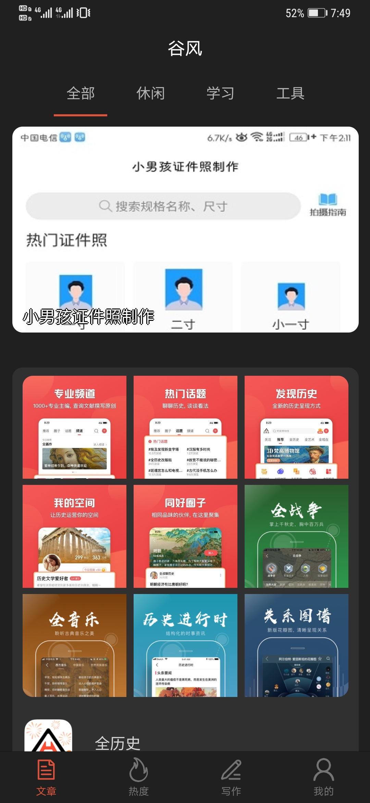
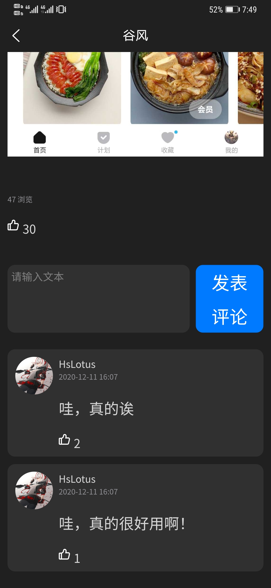
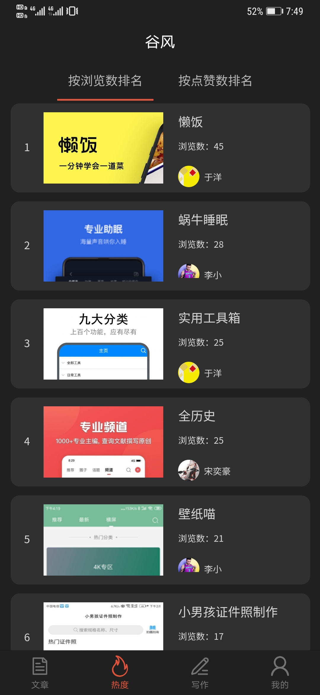
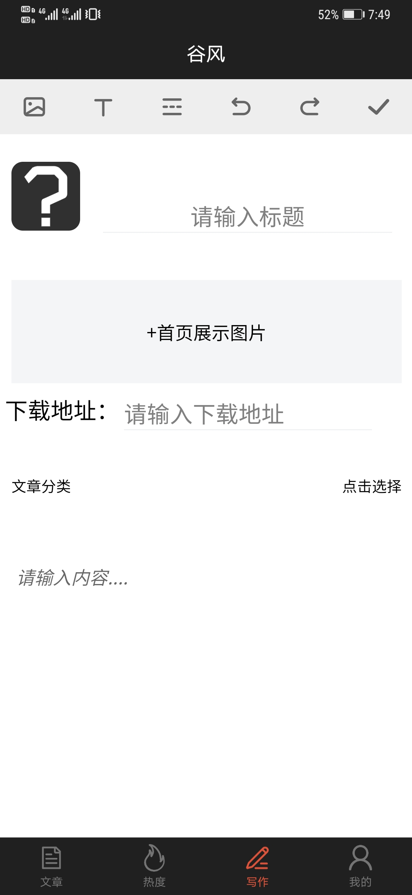
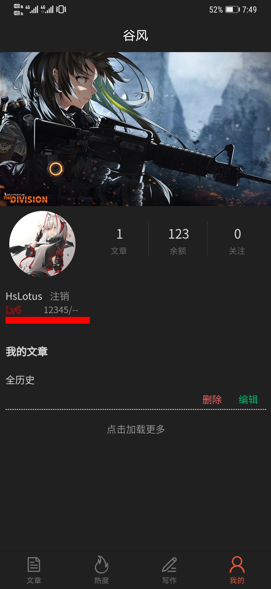

### 部署方法
**1.安装phpstudy2018**（注意版本不是最新版的）

官网地址：[phpstudy](https://www.xp.cn/)

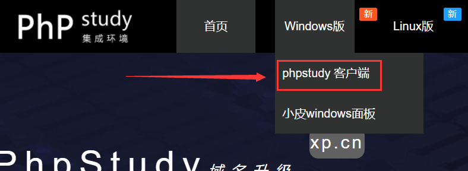

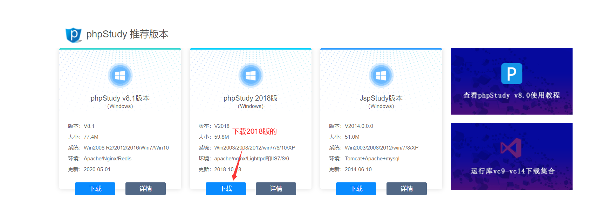

下载解压后打开，选择安装路径。

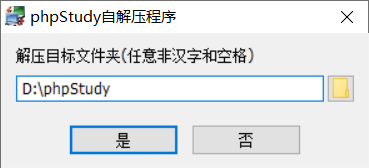

安装完成后跳出该界面，安装完成。

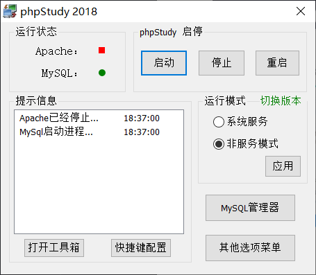

**2.安装HbuilderX**
官网地址：[HbuilderX](https://www.dcloud.io/hbuilderx.html)

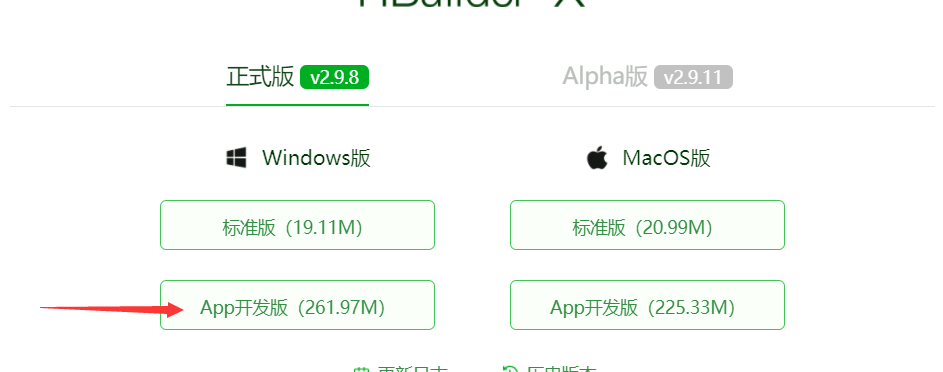

下载完是个zip，解压后即可使用。

**3.安装微信开发者工具或者手机模拟器**

微信开发者工具：[微信开发者工具](https://developers.weixin.qq.com/miniprogram/dev/devtools/download.html)

mumu：[mumu](http://mumu.163.com/)

雷电4：[雷电](https://www.ldmnq.com/)

用微信开发者工具的话控制台会比较清楚，但是有一些东西在微信小程序端是使用不了的，选择自己适合的就行。**如果用手机模拟器且想用微信登录，记得安装微信。**

**4.导入前端**

打开hbuilderx，左上角：文件 => 导入 => 从本地目录导入

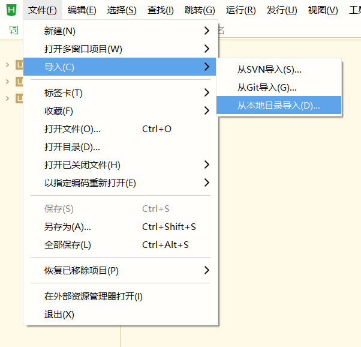

找到前端的文件夹，导入即可。

**5.导入后端**

打开phpstudy,点击图示的网站根目录。或者直接进入 ..\phpStudy\PHPTutorial\WWW 文件夹

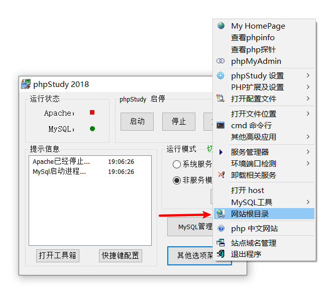

把后端的所有东西都复制粘贴进去，重复的覆盖就行了。

**6.导入数据库**

要使用phpstudy自带 mysql，如果自己装了mysql要。

新建一个名字为 gufeng 的数据库。（这里使用的是navicat可视化操作mysql）

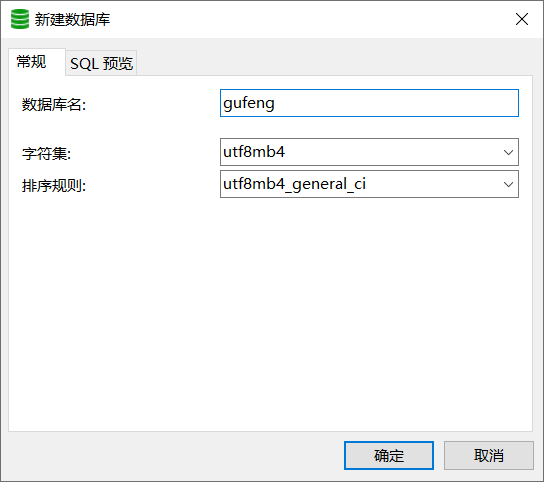

可以用phpstudy自带的 phpMyAdmin。

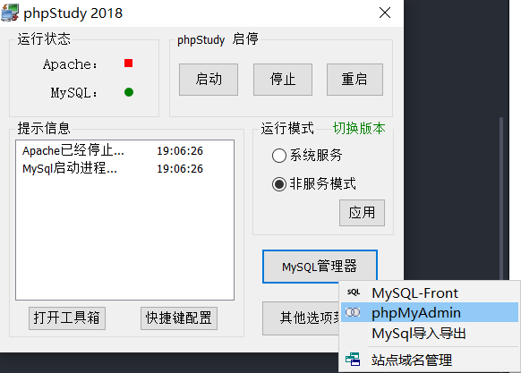

WWW 文件夹中的 gufeng.sql是数据库信息，可以通过navicat导入，也可以手动复制其中语句导入，导入完之后应该是有5张表。

**7.运行项目**

先修改一些东西。

打开 WWW 文件夹中的 index.php（记事本就行）。

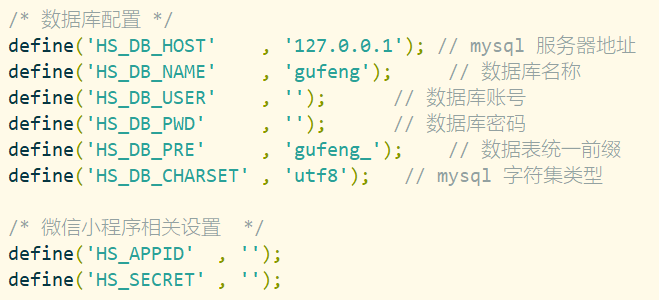

在这填上你数据库的账号密码，phpstudy自带的mysql默认密码都是 root。

如果要使用小程序调试的话下面填上 appid 和 secret，在[微信公共平台](https://mp.weixin.qq.com/)注册即可获得。

打开hbuilder，点击 运行 => 运行到小程序模拟器 => 运行设置。

如果用模拟器的话要配置一下adb，百度一下就可，下面是常用模拟器的adb端口。

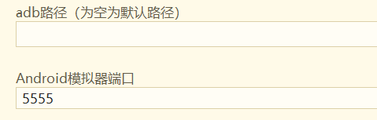

模拟器名称|连接默认端口
--|--
夜神安卓模拟器|62001
逍遥安卓模拟器|21503
BlueStacks（蓝叠安卓模拟器）|5555
雷电安卓模拟器|5555
天天安卓模拟器|5037
网易MuMu（安卓模拟器）|7555
安卓模拟器大师|54001
Genymotion|5555

如果用微信开发者工具的话要配置一下安装路径

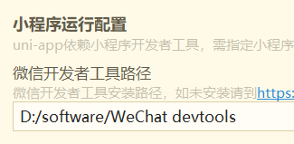

微信还要配置一下appid，在项目根目录的 manifest.json 里面，和之前的那个一样，在[微信公共平台](https://mp.weixin.qq.com/)弄。

至此项目配置完毕，打开phpstudy，启动服务。

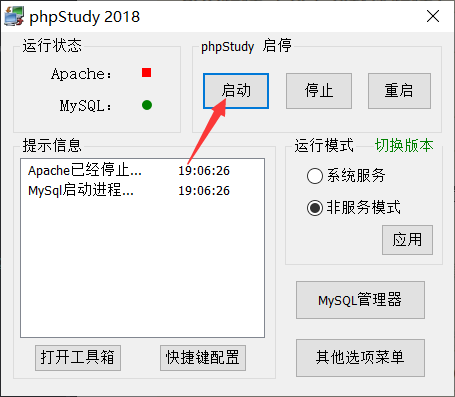

然后在hbuilder里面运行前端即可。

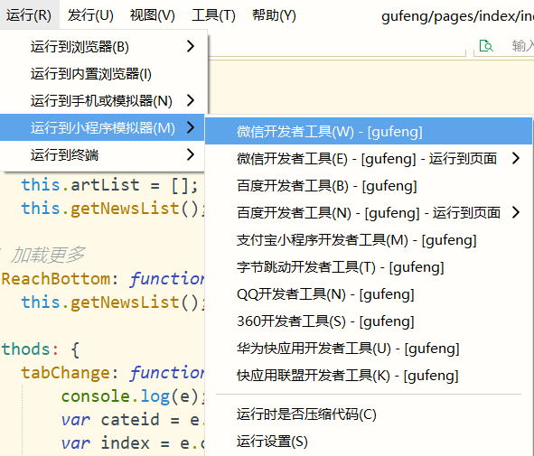
